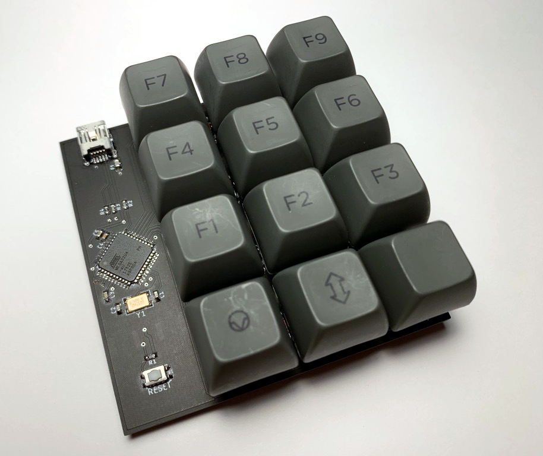
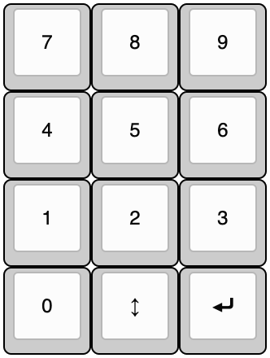
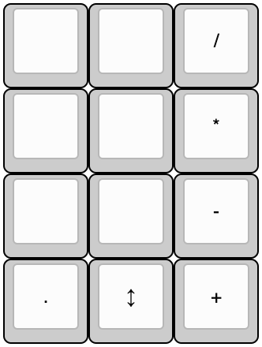
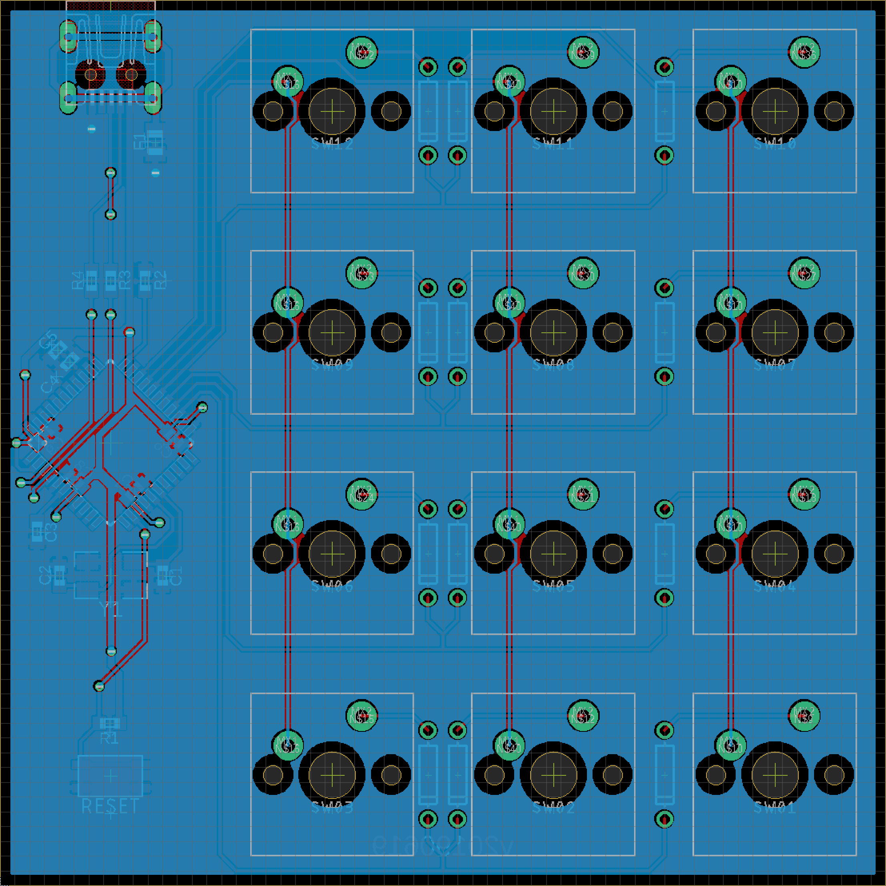
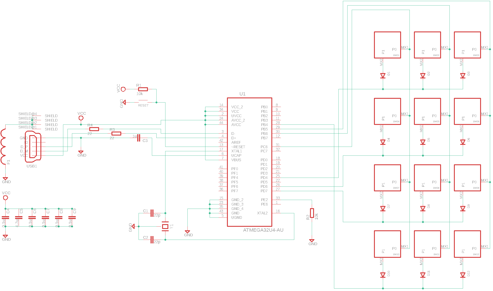

# Macropad

A 12-key 4x3 macropad for Cherry MX Switches designed in Eagle and
configured with QMK.

* [PCB](PCB/)
* [Bill of Materials](BOM.md)
* [Firmware](Firmware/)

## Assembled Board

## Keymap

| Base                          | Raised                        |
|:-----------------------------:|:-----------------------------:|
|    |  |

## PCB

| Top                        | Bottom                     |
|:--------------------------:|:--------------------------:|
|     |  |

## Schematic

